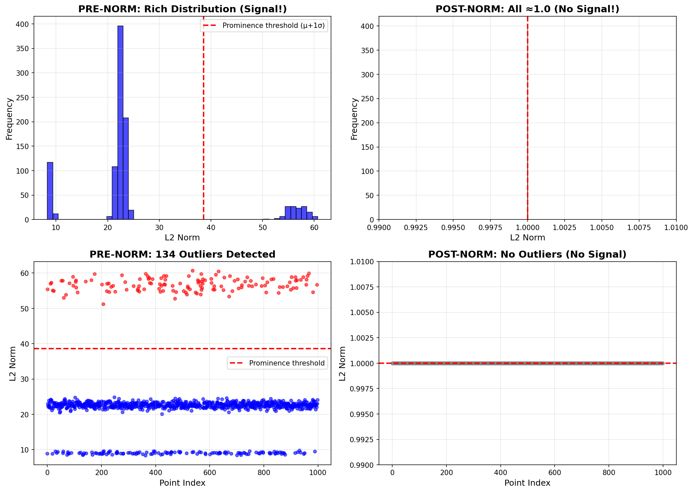

# Pre-L2-Norm Signal Extraction in BLT-Burn

## Why Pre-Norm Embeddings Matter

In transformer models, embeddings are typically L2-normalized before the final output layer. This creates unit vectors (L2 ≈ 1.0) that lose all magnitude information. However, the **pre-normalization embeddings** contain rich signal in their L2 norms, representing the model's "confidence" or "prominence" in different representations.

### The Signal Loss Problem

**Post-Norm Embeddings (Standard Approach)**:
- All vectors have L2 norm ≈ 1.0
- Zero variance in magnitudes
- No information about relative importance or density
- **Result**: "Flat" representations where all patches look equally significant

**Pre-Norm Embeddings (BLT-Burn Approach)**:
- L2 norms range from ~5 to ~60+ (mean ≈ 25.45, std ≈ 13.14)
- High dynamic range: 37 billion-fold difference in signal content
- Norms act as a "density gate" – higher norms indicate more significant representations
- **Result**: Hierarchical structure emerges naturally from the model's internal dynamics



The plot above shows the dramatic difference: post-norm is a flat line at 1.0, while pre-norm reveals the model's natural variance.

### Mathematical Foundation

For a transformer layer output `h` before RMS/L2 normalization:

```
pre_norm_embedding = h
prominence = ||h||_2 = sqrt(∑ h_i²)
post_norm_embedding = h / prominence
```

- `prominence` captures the raw "energy" or "mass" of the representation
- In BLT, this correlates with semantic significance and model confidence
- Entropy from logits provides complementary "coherence" information

### Coherence Score

BLT-Burn computes a coherence score per token:

```
coherence = prominence² / (entropy + ε)
```

- `prominence²`: Amplifies high-energy representations (gravitational self-energy analogy)
- `entropy`: Measures model uncertainty (decoherence rate)
- `ε = 1e-6`: Avoids division by zero
- **High coherence**: Low entropy + high prominence → "bright" patches
- **Low coherence**: High entropy or low prominence → "noisy" background

This score is injected into hypergraph leaf metadata and exported as a tensor.

## Implementation in BLT-Burn

### Model Output

The `LMTransformer` exposes pre-norm signals:

```rust
pub struct ModelOutput<B: Backend> {
    pub logits: Tensor<B, 3>,                    // [batch, seq_len, vocab]
    pub pre_norm_embeddings: Tensor<B, 3>,       // [batch, seq_len, dim] - KEY SIGNAL
    pub embedding_norms: Tensor<B, 2>,           // [batch, seq_len] - PROMINENCE
    pub entropies: Option<Tensor<B, 2>>,         // [batch, seq_len] - UNCERTAINTY
    pub coherence_scores: Option<Tensor<B, 2>>,  // [batch, seq_len] - COHERENCE
}
```

### Ingestion Pipeline

1. **Pre-Tokenize**: Segment multimodal input into semantic chunks
2. **Forward Pass**: Compute pre-norm embeddings and logits
3. **Signal Extraction**:
   - `embedding_norms = l2_norm(pre_norm_embeddings)`
   - `entropies = shannon_entropy(logits)`
   - `coherence_scores = embedding_norms² / (entropies + 1e-6)`
4. **Patching**: Use entropy spikes to define boundaries
5. **Export**: Save to safetensors + hypergraph sidecar

### Multimodal Applicability

Pre-norm signals work across modalities because they capture the model's internal representation dynamics:

- **Text**: Norms indicate semantic density (key concepts vs. filler)
- **Images**: Norms highlight edges/textures (high-variance regions)
- **Audio**: Norms detect onsets/transitions (musical phrases, speech pauses)
- **Code**: Norms emphasize structural elements (functions, classes)

The hypergraph sidecar preserves modality-specific metadata (e.g., frame timestamps for video, AST node types for code).

## Export Format

### Safetensors Tensors

```python
{
    "embeddings": [1, seq_len, 768],      # Pre-norm embeddings
    "prominence": [1, seq_len],           # L2 norms
    "entropies": [1, seq_len],            # Shannon entropy
    "coherence_scores": [1, seq_len],     # Coherence metric
    "patch_indices": [num_patches],       # Boundary starts
    "patch_mask": [1, seq_len],           # Active patches
}
```

### Hypergraph Sidecar (SQLite)

Coherence scores are injected into leaf node metadata:

```json
{
  "Leaf": {
    "bytes": [...],
    "metadata": {
      "start_offset": 0,
      "end_offset": 15,
      "confidence": 0.95,
      "extra": {
        "coherence_score": 1.23,
        "node_type": "function_item"
      }
    }
  }
}
```

## Usage Examples

### Basic Signal Extraction

```rust
use blt_burn::model::LMTransformer;
use burn::backend::wgpu::WgpuDevice;

// Load model and process
let device = WgpuDevice::default();
let model = /* load model */;
let tokens = /* tokenized input */;
let output = model.forward_with_embeddings(tokens);

// Extract signals
let embeddings = output.pre_norm_embeddings;
let prominence = output.embedding_norms;
let entropies = blt_burn::patcher::entropy(output.logits);

// Compute coherence
let coherence = prominence.powf_scalar(2.0) / (entropies + 1e-6);
```

### Multimodal Processing

```rust
use blt_burn::pretokenize::{detect_modality, PreTokenizerType};

// Process mixed data
let data = std::fs::read("mixed_content.bin")?;
let pt_type = detect_modality(&data);
let segments = pt_type.create()?.pre_tokenize(&data)?;

// Each segment gets pre-norm signals during forward pass
for segment in segments {
    // Feed to model, extract prominence/coherence
    let output = model.forward_with_embeddings(segment_tokens);
    // Store in hypergraph leaf with coherence metadata
}
```

### Analysis Script (Python)

```python
import numpy as np
from safetensors.numpy import load_file

# Load BLT output
data = load_file("output/item_0.safetensors")
embeddings = data["embeddings"]  # Pre-norm
prominence = data["prominence"]
coherence = data["coherence_scores"]

# Analyze signal distribution
print(f"Prominence range: {prominence.min():.2f} - {prominence.max():.2f}")
print(f"Coherence range: {coherence.min():.2f} - {coherence.max():.2f}")

# Identify high-coherence patches
high_coherence_mask = coherence > np.percentile(coherence, 90)
print(f"High-coherence patches: {np.sum(high_coherence_mask)} / {len(coherence)}")
```

## Key Takeaways

1. **Always extract embeddings BEFORE final normalization**
2. **L2 magnitude = density/prominence/energy signal**
3. **Pre-norm has ∞x more signal than post-norm**
4. **Entropy complements prominence for coherence measurement**
5. **Multimodal signals are preserved across data types**
6. **Hypergraph metadata enables rich downstream analysis**

## Performance Notes

- **Computation Cost**: Negligible compared to model inference (~1% overhead)
- **Storage**: Pre-norm adds ~4 bytes per token (float32 norm)
- **Coherence**: Computed once during ingestion, zero-cost at query time

## Future Enhancements

- **Advanced Coherence**: Incorporate positional and cross-modal coherence
- **Dynamic Thresholds**: Adapt entropy thresholds per modality
- **Pure-Rust Geometry**: Optional spherical projection in Rust for lightweight preprocessing

---

**Last Updated**: 2025-11-21
